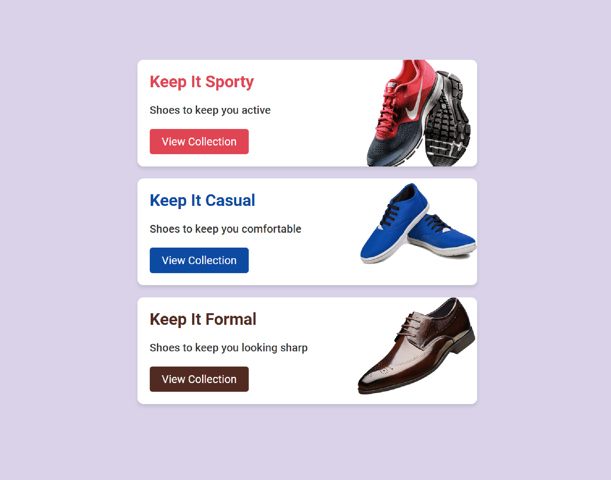
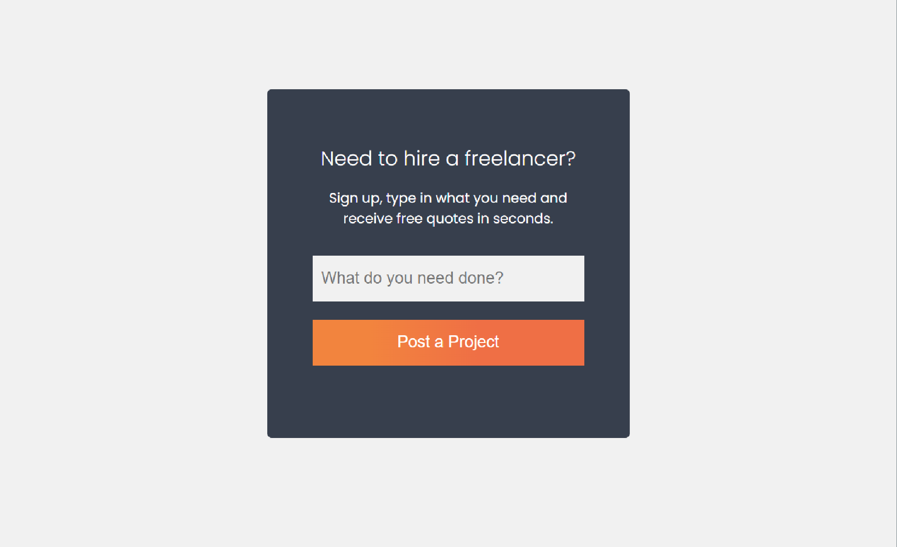

# Modern-HTML-CSS-From-The-Beginning
It will be updated as projects are realized. (They are in order from new to old.)

## Tutor Website 

## Lumina Creative 

## Bono Landing Form

## Pricing Card Mini Project

## Shoe Card Mini Project

## Freelance Form Project

