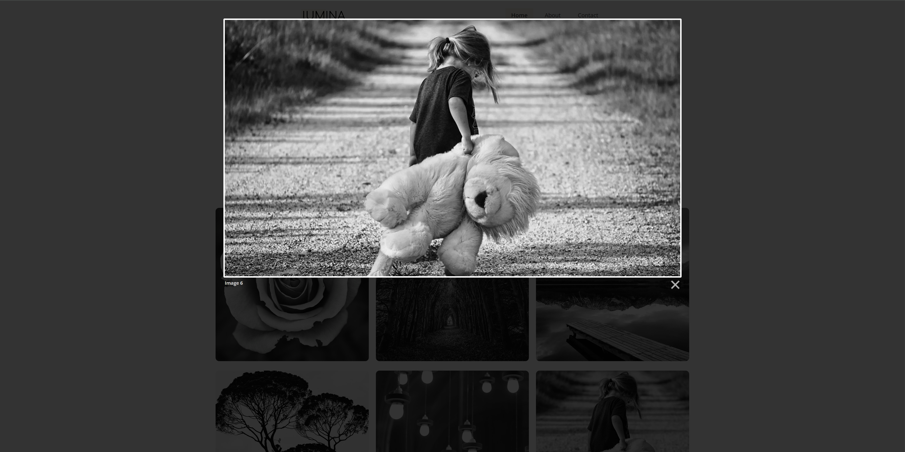
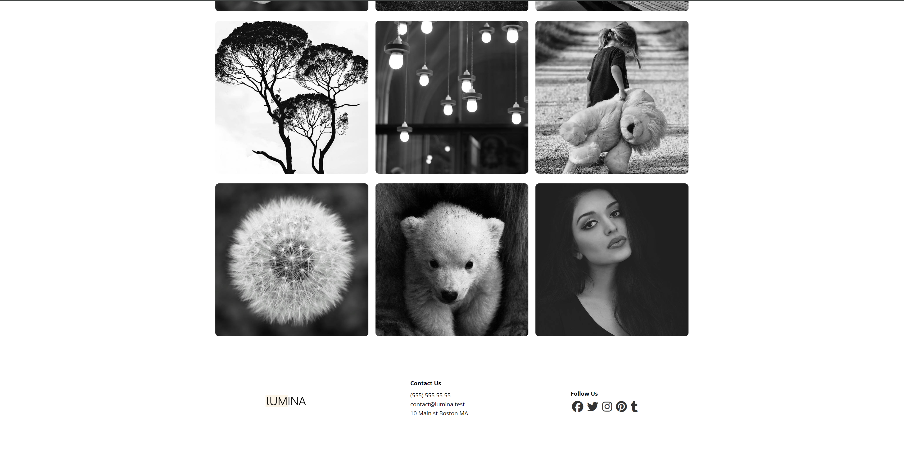
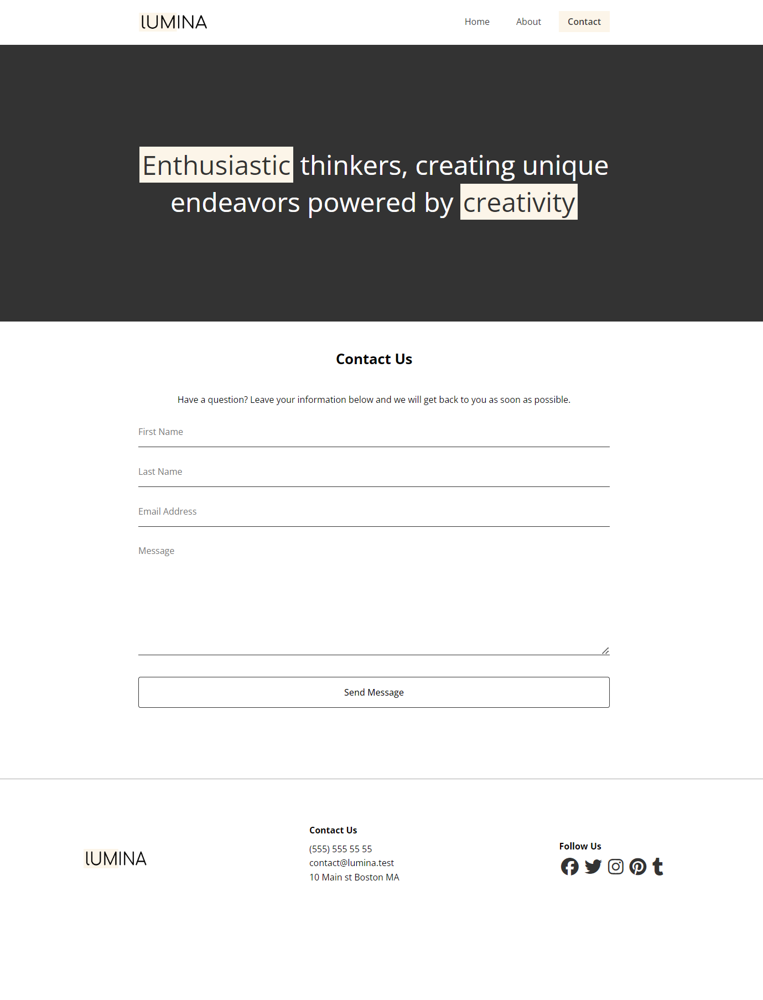
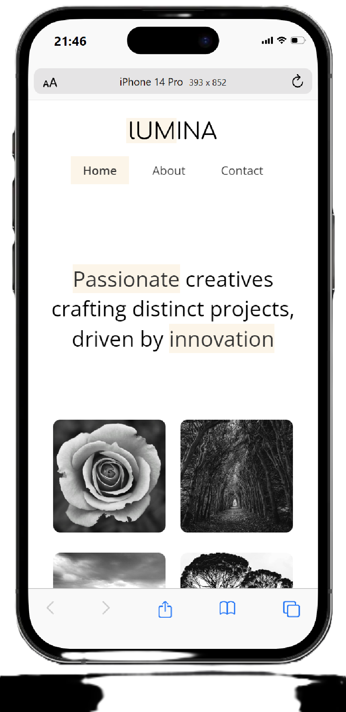

# Screenshot of the project:

---

## If you want to examine the codes I wrote:

- **[index.html](index.html)**
- **[about.html](about.html)**
- **[contact.html](contact.html)**
- **[styles.css](css/styles.css)**
